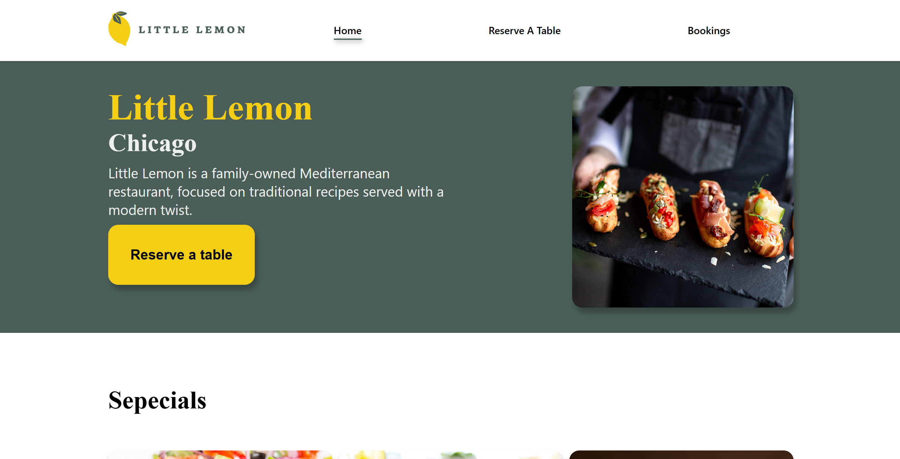
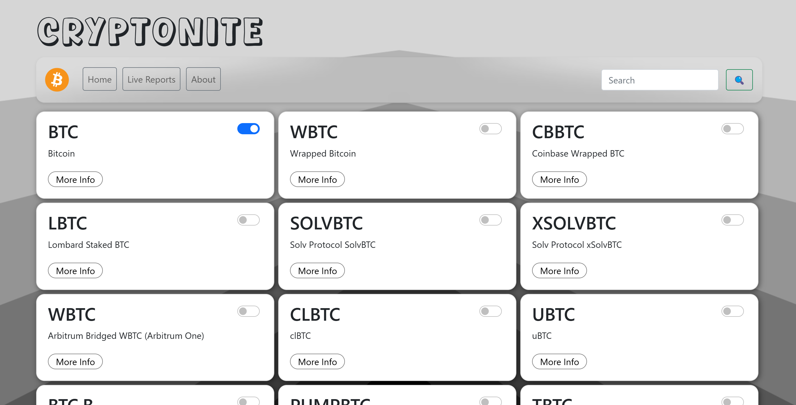

# Hello World, I'm Shalev, a Full-Stack developer 👋
- 🚀 Passionate about building modern, responsive, and user-friendly front-end experiences  
- 💡 Interested in web development (React.js, Node.js, TypeScript) and eager to learn new technologies  
- 📚 Currently learning advanced React, TypeScript, and testing tools such as Jest and React Testing Library  
- 🤝 Open to collaboration on open-source projects, innovative front-end tools, and web apps that solve real-world problems  

## 📑 Tech Stack:
 
 
 
 
 
 
 
 
 
 
 
 
 
 
 
 

## 📫 How to Reach Me
- 💬 Send me a message on [LinkedIn](https://linkedin.com/in/shalev-shaul-5843772a3)
- 📧 Email me at [shalevshaul1@gmail.com](mailto:shalevshaul1@gmail.com)

## 💻 Featured Projects

<table>
  <tr>
    <td width="33%" valign="top">
      <h3 align="center">🏝️ Vacation Management System</h3>
      
        

       
        
        
         
         
        

      

        A full-stack web application for managing vacations, designed with separate interfaces for regular users and administrators.
      

      

        
        
      

    </td>
    <!--  -->
    <td width="33%" valign="top">
      <h3 align="center">🍋 Little lemon reserve a table</h3>
      
        

       
        
        
        
        
        
        

      

        A modern React web application for Little Lemon restaurant, featuring an interactive menu, table reservations, and customer reviews.
      

      

        
        
      

    </td>
    <!--  -->
    <td width="33%" valign="top">
      <h3 align="center">💰 Crypto Information Website</h3>
      
        

       
        
        
        
        
         
        

      

        A dynamic platform providing real-time cryptocurrency data. Users can view cryptocurrencies, search for specific coins, and track their prices.
      

      

        
        
      

    </td>
  </tr>
</table>

## 🔝 Top Contributed Repo

## 🧬 My Coding DNA 

